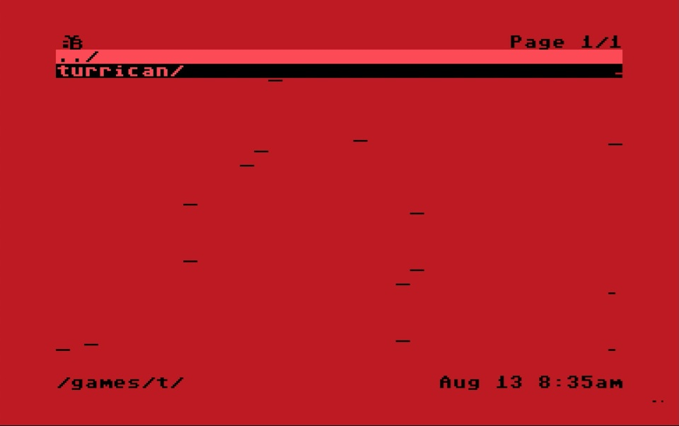
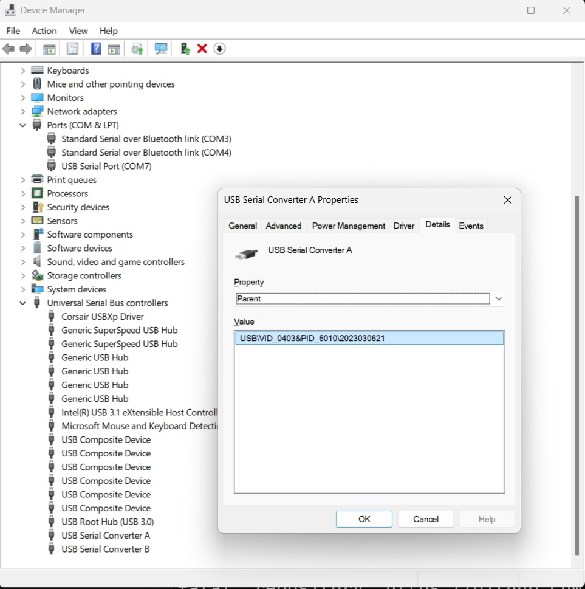

# Tang Nano 20K BL616 Firmware
### ISEVIC currently requires that your Tang Nano 20K boared has the 2023030621 version of the BL616 firmware. If you bought your Tang Nano recently, most likely it has a newer firmware and will need to be re-flashed with the supported version.

If you do not have the correct version you may see noise like this in the picture:

## Instructions
You'll need to first verify the version that is on your device, and if it is not 2023030621, re-flash the device.

### 1. Check the version
Unplug from your C64. On a Windows machine, plug the TN20K into your USB port, then open the Device Manager and look for "USB Serial Converter A/B" under "Universal Seerial Bus controllers", right click and select Properties, then go to the Details tab and choose the Parent Property as in the below:

If the version string is anything other than what is shown in the picture, proceed to the next step.

### 2. Download the tools and firmware
- You'll need to use the BLDevCube software which can be found [here](https://dl.sipeed.com/shareURL/SLogic/SLogic_combo_8/4_application/Tools)
- The correct version of the firmware is [here](../Boards/Tang_Nano_20K/Bitstream/bl616/bl616_2023030621.zip), navigate to the link and choose *Download raw file*, and then unzip the .zip file.

### 3. Re-flash the device
There is a detailed tutorial on how to re-flash the device [here](https://wiki.sipeed.com/hardware/en/tang/common-doc/update_debugger.html).

Basically,
1. Put the device into DFU mode by first unplugging from USB, then while holding the devices Update Button on the board, plug it back in. If you have the Isevic top plate you will need to remove it as the update button is hidden below the top plate and is located near the HDMI connector.
2. Start BLDevCube, select "BL616/618" as the chip model
3. In the new window, check the "Enable" checkbox below the "Single download option". Make sure the starting value near the enable button is 0x0.
4. Click Browse to locate the bl616_2023030621.bin file downloaded previously
5. Click "Create & Download" to flash to the device

### 4. Verify
1. Verify again from the Windows Device Manager that you have the correct version.
2. Unplug from USB.
3. If needed, finish the installation steps including flashing the Isevic bitstream as describe on the [main page](../README.md).
3. Plug back into your C64, you should now have a stable picture without the noise.

