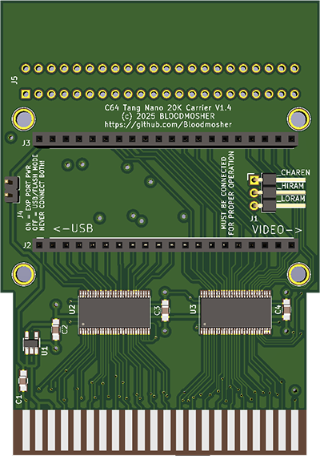

# ISEVIC - Integrated System for Enhancing VIC Output
### ISEVIC is an FPGA core for enabling digital video via HDMI on the C-64. It works by watching the bus on the cartridge port. It then translates those signals into a picture for display. It can run on multiple FPGA platforms including the Tang Nano 20K described here.

### Watch the first "teaser" video here:

### And then a more in-depth introductory video:

## Getting Started
- You'll need a Tang Nano 20K board with headers like [this](https://www.amazon.com/dp/B0C5XJV83K) flashed with the provided bitstream plus the ISEVIC carrier board for the C-64 cartridge slot (see below).
- **For correct operation, three additional wires must be run from the CPU (_CHAREN, _HIRAM, _LORAM on pins 27, 28, 29) to the carrier board.**
- Without them you'll see a correct picture upon boot, but most programs will inevitably write to IO space with a different memory configuration than the default which will result in incorrect interpretation of the signals. 
- Use Dupont wires like [these](https://www.amazon.com/dp/B07GCZV4BS) (make sure they are long enough to route outside the board), with IC mini grabbers like [these](https://www.amazon.com/dp/B08V1HFHRY) or similar.

### Supported Hardware
- PAL and NTSC "new" with automatic detection
- NTSC "old" and Drean machines are NOT supported at this time
- Core runs on the multiple FPGA devices
- Tang Nano 20K carrier board gerbers and bitstream are included in this repo

### Display Devices
- Modern OLED monitors and TVs work really well. Game mode can also give an extra silky feel to scrolling images.
- My personal favorite monitor for the ISEVIC is the 32" LG 32GS95UE - it can handle the 1280x720 output of the Tang Nano 20K at both PAL and NTSC refresh rates, with no ghosting artifacts.
- Many IPS or TFT panels exhibit ghosting artifacts - your mileage will vary.

### What about sound?
While not part of the ISEVIC core itself, experimental support for sound by integrating SID emulation with the ISEVIC core is included in the provided bitstream. 

### Passthrough Port
Most cartridges should work via the passthrough port, however some are more sensitive to the additional path length and sharing of the signals. Examples that have been tested and seem to work well:
- 1541 Ultimate-II
- Backbit
- CMD Super CPU Rev 1A
- Epyx Fast Load
- Several simple game cartridges

The EasyFlash 3 is an example found to be more sensitive, e.g. some games failed to load in my testing. A future update may address this once fully understood.

### Tang Nano 20K Carrier

- Gerbers for the Tang Nano 20K Carrier board can be found [here](./Boards/Tang_Nano_20K/Carrier/). 
- An optional [top plate](./Boards/Tang_Nano_20K/Top_Plate/) is also provided to help prevent touching the board during operation, and to mask the LEDs that activate due to the way signals are shared on the board.
- Always unplug the cartridge from your C-64 before updating the bitstream.
- The power select jumper on the Tang Nano 20K carrier board allows powering the device via USB but most users will have no need for this. 
- **Never connect USB with the jumper installed, you will send +5V into your C-64.**
- S1 and S2 buttons on the Tang Nano 20K provide access to the on-screen debug/calibration tool and reset of the C-64.
- For updating the bitstream on Mac and Linux, use [OpenFPGALoader](https://github.com/trabucayre/openFPGALoader)
    - Mac users with [Homebrew](https://brew.sh/) can just type `brew install openfpgaloader` in the Terminal to install it
    - For updating using OpenFPGALoader:
        - Download the [isevic_tn20k_v1_0.fs](Boards/Tang_Nano_20K/Bitstream/isevic_tn20k_v1_0.fs) bitstream file by right-clicking on the link and choosing *Save Link As...*
        - Open the Mac Terminal or Linux shell and `cd` into the directory where you've saved the `isevic_tn20k_v1_0.fs` file
        - Make sure you've connected the Tang Nano 20K module via USC-C to your Mac or Linux computer
        - Run `openfpgaloader -b tangnano20k -f isevic_tn20k_v1_0.fs`

- For updating the bitstream on Windows, you will need the Gowin Education Edition IDE. 
    - [Windows](https://dl.sipeed.com/shareURL/TANG/gowin_ide) (also available for [Linux](https://dl.sipeed.com/shareURL/TANG/gowin_ide))
    - For updating the device using the Gowin Programmer from the above download:
        - Download the [isevic_tn20k_v1_0.fs](Boards/Tang_Nano_20K/Bitstream/isevic_tn20k_v1_0.fs) bitstream file by right-clicking on the link and choosing *Save Link As...*
        - Attach a USB cable from your PC to the Tang Nano 20K USB-C socket
        - Launch the Gowin Programmer. The *Cable Setup* dialog will appear and should detect the USB cable and the Tang Nano 20K device.  The FPGA will appear in the device list as *GW2AR-18C*.
        - If any device appears in the device list with anything other than *GW2AR-18C* then click on it and hit the *Delete Device* button.  If there no devices after doing this, click *Scan Device* and it will say *Multi-device found*, select *GW2AR-18C*.
        - Right click on the device and select *Configure Device*
        - Select *External Flash Mode*, choose *Generic Flash* in *External Flash Options*, leave address at *0x000000*. Select the `isevic_tn20k_v1_0.fs` file in *Programming Options File Name*. Hit *Save*.
        - Hit *Program/Configure*.  It will program the device.

### Clock Adjustment
For smooth scrolling the FPGA's pixel clock runs at a speed to match the Commodore 64's frame rate. It assumes the Commodore 64's clock is set to a standard specification.
If it is running too fast or too slow you'll see the screen flash periodically when it re-adjusts the clock sync. If tuned properly you should be able to run for many hours without ever seeing a sync loss occur.

- In order to tune the value you'll need an anti-static ceramic screwdriver, like [this one](https://www.amazon.com/Frequency-Screwdriver-Anti-static-Plastic-Ceramic/dp/B07GZHKH4B) or equivalent. A metal one will interfere with the signal.

- Locate the variable capacitor near the clock oscillator next to the VIC chip.
- To adjust the clock, press the S1 button on the FPGA to bring up the on screen calibration tool.
- The first number is the Commodore 64's clock speed. The measurement isn't perfect but is close enough.
- On the second row, the first three digits are the line number that the VIC is on at the top of the FPGA's video frame. The second three digits are the same thing but for the previous frame.
- When the clock is calibrated correctly the second number is always one higher than the first.
- You want the numbers to be changing as slowly as possible to avoid losing sync.
- The last two digits keeps a count of how many times sync loss has occurred.
- Make ultra tiny movements until you reach a value close to or a little under 985,248 for PAL at 50.1 hertz or 1,022,727 for 59.826 hertz NTSC. Watch the effect on the second row and make sure the line number is decreasing not increasing. The tuned value does not need to match these exactly and in fact on most setups I have found a little under works best.

### Tested Functionality
All supported C-64 video modes and most demo tricks have been tested on both PAL and NTSC machines. However, there is a massive library of software for the C-64 and inevitably there will be some display bugs. If you find an example, please open an issue and provide steps to reproduce. 

## Releases
### V1.0: Initial release
- Support for PAL/NTSC "new" VIC chips, NTSC "old" and Drean are explicitly disabled and will show a red screen
- Known Issues
    - The loading progress bar on Super Mario Bros incorrectly shows a leading black line as the bar moves from left to right.
    - When using the Easy Flash 3 in the pass through port, some programs fail to load.
